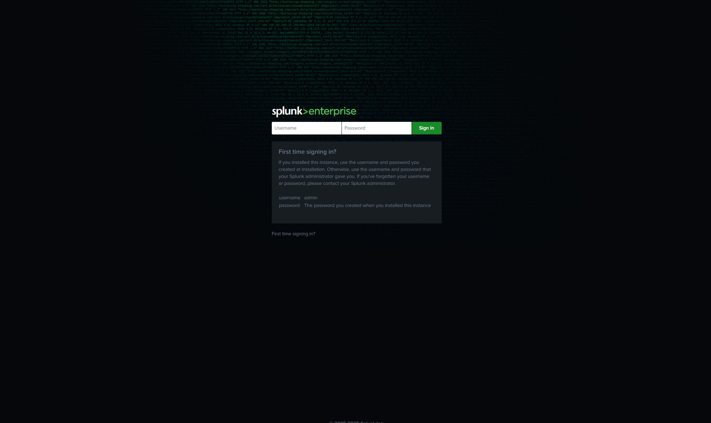
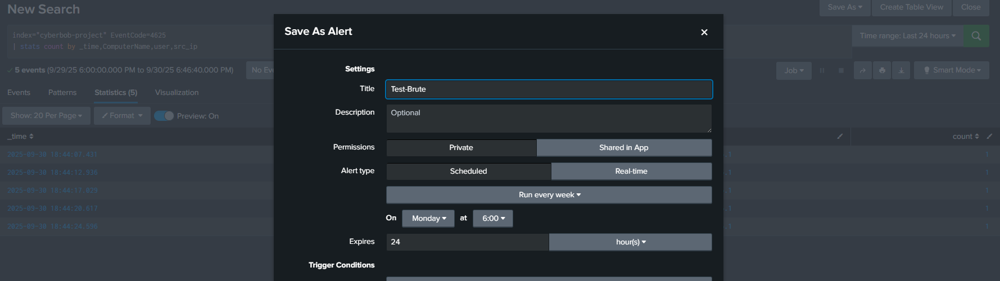

# 🧠 SOC Automation Lab – Part 1: Splunk Alert → n8n Webhook Integration
**By Allante Johnson (CyberBob)**

---

## 🧭 Overview
This lab demonstrates the first stage of a **Security Operations Center (SOC) Automation Pipeline** that integrates **Splunk** with **n8n** to automate alert workflows.  

The goal of this phase is to:
- Deploy core infrastructure (VMs)
- Configure Splunk for event ingestion
- Create alerts and push them via **webhooks**
- Verify alert delivery into **n8n**

This foundation sets up the environment for **automated alert enrichment and response**, which will be built in future phases.

---

## 🖥️ Lab Environment
| Component | Description |
|-----------|--------------|
| 🪟 **Windows 10 VM** | Generates logs/events forwarded to Splunk |
| 💽 **Splunk VM** | Installed Splunk Enterprise to ingest logs and trigger alerts |
| 🧠 **n8n VM** | Runs automation workflows and receives Splunk webhooks |
| 🧰 **Kali Linux VM** | Used for attack simulation and testing detection rules |

Each VM runs locally via **VMware Workstation**, configured on the same **192.168.176.0/24** network for internal communication.

---

## ⚙️ Setup Steps

### 1. 🔧 Splunk Installation
Deployed **Splunk Enterprise** on Ubuntu VM:
```bash
wget -O splunk-10.0.1-c486717c322b-linux-amd64.deb "https://download.splunk.com/products/splunk/releases/10.0.1/linux/splunk-10.0.1-c486717c322b-linux-amd64.deb"
sudo dpkg -i splunk-10.0.1-c486717c322b-linux-amd64.deb
sudo /opt/splunk/bin/splunk start --accept-license
```

✅ **Screenshot:**  
  


---

### 2. 🧠 n8n Installation
Used **Docker Compose** to deploy n8n automation server on a separate VM:
```bash
mkdir n8n-compose && cd n8n-compose
sudo nano docker-compose.yaml
sudo docker-compose pull
sudo docker-compose up -d
```

✅ **Screenshot:**  


---

### 3. 🔗 SSH Access to Servers
Established secure access from the local machine:
```powershell
ssh cyberbob@192.168.176.130   # Splunk VM
ssh cyberbob@192.168.176.131   # n8n VM
```

✅ **Screenshot:**  


---

### 4. 📥 Ingesting Logs into Splunk
Configured Splunk to ingest **Windows Event Logs** from the Windows 10 VM.

✅ **Screenshot:**  


---

### 5. 🚨 Creating a Splunk Alert
Built a search query to detect **EventCode 4625** (failed logons):
```spl
index="cyberbob-project" EventCode=4625 
| stats count by _time, ComputerName, user, src_ip
```
Saved as an alert titled **“Test-Brute”**.

✅ **Screenshot:**  


---

### 6. 🌐 Adding Webhook Trigger
Added a **Webhook** action to the alert to POST results to n8n:

```text
URL: http://192.168.176.131:5678/webhook-test/2064c024-3f42-4784-b400-211d23a6abe7
Method: POST
Payload: JSON
```

✅ **Screenshot:**  


---

### 7. ✅ Verifying Alert Delivery in n8n
n8n successfully received the webhook payload from Splunk.

✅ **Screenshot:**  


Payload example:
```json
{
  "search_name": "Test-Brute",
  "ComputerName": "DESKTOP-HRCU8CB",
  "user": "cyberbob",
  "src_ip": "192.168.176.1",
  "count": 1
}
```

---

## 🧩 Summary
In **Part 1**, we successfully:
- Set up **Splunk** and **n8n** on separate VMs  
- Ingested logs from a Windows endpoint  
- Created an alert for brute-force attempts  
- Sent alert data to **n8n** using **webhooks**  

This lays the groundwork for **Part 2**, where we’ll:
- Automate enrichment (e.g. IP lookup, user details)
- Send notifications (Slack, email)
- Trigger response workflows

---

## 📂 Repository Structure
```
SOC-Automation-Lab/
│
├── README.md
└── screenshots/
    ├── splunk download.png
    ├── splunklogin.png
    ├── installing n8n.png
    ├── local machine connecting.png
    ├── logs ingested.png
    ├── creatingalert.png
    ├── addingwebhook.png
    └── n8nalert.png
```

---

## 🚀 Next Steps
- 🧠 Build enrichment workflow in n8n (IP reputation lookup)
- 📣 Add Slack/Email notification nodes
- ⚡ Trigger automated response (disable user, isolate host)

🔗 Continue to **[Part 2: Automated Alert Enrichment & Slack Notifications](https://github.com/CyberAllante/SOC-Automation-Lab-2)**
